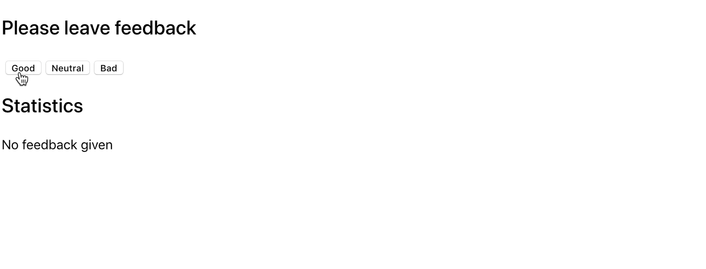

**Read this in other languages: [Russian](README.md), [Ukrainian](README.ua.md).**

# Feedback Widget

Like most companies, Cafe Expresso collects feedback from its customers. Your task is to create an application to gather statistics. There are only three options for feedback: good, neutral, and bad.

## Step 1

The application should display the count of collected feedback for each category. The application should not retain feedback statistics between different sessions (page refreshes).

The application's state must be structured as follows, and adding new properties is not allowed:

```bash
state = {
  good: 0,
  neutral: 0,
  bad: 0
}
```

The interface might look like this.


## Step 2

Enhance the application's functionality to display more statistics about collected feedback in the interface. Add display of the total count of collected feedback from all categories and the percentage of positive feedback. To achieve this, create auxiliary methods `countTotalFeedback()` and `countPositiveFeedbackPercentage()`, calculating these values based on the data in the state (computed data).


## Step 3

Perform a refactoring of the application. The application's state should remain in the root component `<App>`.

- Extract the display of statistics into a separate component `<Statistics good={} neutral={} bad={} total={} positivePercentage={}>`.
- Extract the block of buttons into a component `<FeedbackOptions options={} onLeaveFeedback={}>`.
- Create a component `<Section title="">` that renders a section with a title and children. Wrap each of `<Statistics>` and `<FeedbackOptions>` in the created section component.

## Step 4

Expand the application's functionality so that the statistics block is rendered only after at least one feedback has been collected. Display the message for the absence of statistics in the `<Notification message="There is no feedback">` component.


